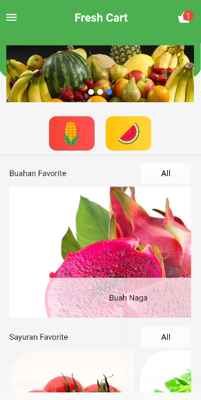
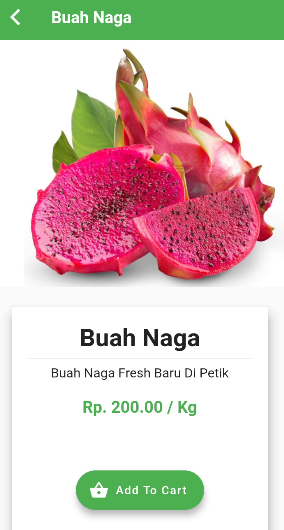
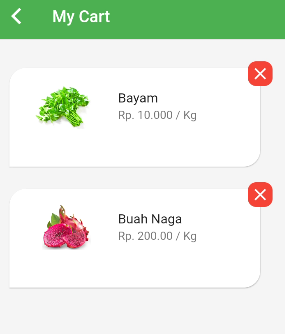

# FRESH CART APP
This application was created from the first DSC bootcampt event, this event shopping fruits and vegetables using firestore

Home Screen :  

Detail Screen :  

Cart Screen :  

## Challenge for Participant
- create your github account
- create repository with name <b>fresh_cart</b>
- Push Your project to yout github repository
- if done, joining to WA group to report your repository <a href="https://chat.whatsapp.com/GJYd6Nnso3DChsH98pmsQV">here</a>

## Participant github repo
list repository github from participant :
- <a href="https://github.com/username/repo">github.com/username/repo</a>

## SLIDE & MODUL
- slide <a href="https://bit.ly/dsc_bootcamptslide">here</a>
- Modul <a href="https://bit.ly/dsc_bootcamp1">here</a>

